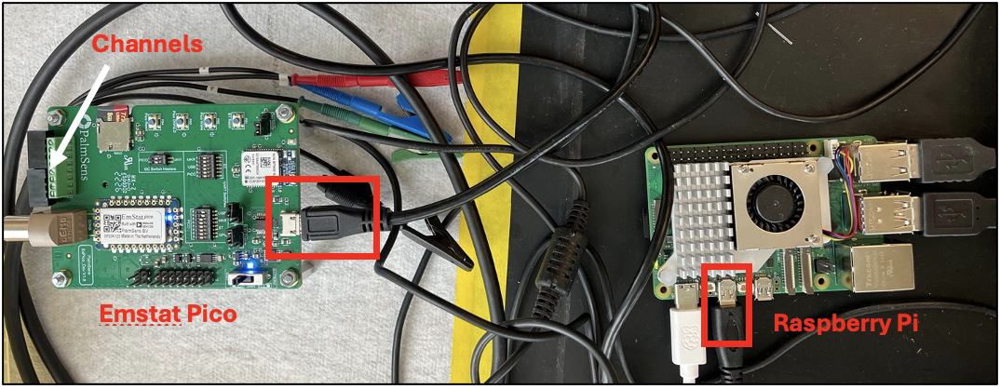

# Plotting SWV with RPi and Emstat4

This repo contains the necessary scripts to run square wave voltammetry (SWV) scans on a Raspberry Pi (RPi).

This guide will show the steps to run one scan, as well as one experiment (many scans at a time).

### Authors
**Author:** Adam Mak (maka9)  
**Co-Supervisor:** Sadman Sakib (sakibs)

---

## Hardware Guide

The RPi should have 5 connections:
1. **Power Supply**
2. **Monitor**
3. **Keyboard**
4. **Mouse**
5. **Emstat4 or Emstat Pico**

If running a full experiment, the RPi must also be connected to a **Teensy 4.x** via GPIO pins. 

### Channels

For running single scans:

| **Device** | **Connection** |
|-|-|
| RPi | Monitor, Keyboard, Mouse, Power Supply, Emstat 4/Pico |
| Emstat 4/Pico | RPi |

For running experiments:

| **Device** | **Connection** |
|-|-|
| RPi | Monitor, Keyboard, Mouse, Power Supply, Emstat 4/Pico, Teensy 4.x |
| Emstat 4/Pico | RPi, MUX |
| MUX | Emstat 4/Pico, Teensy 4.x |
| Teensy 4.x | RPi, MUX |

<div align="center">

  
**Figure 1**: Raspberry Pi and Emstat Pico connection for running single scans.

</div>

---

## First time - Prerequisite steps

**Clone repo**  
Open up terminal and execute the following command
```bash
git clone https://github.com/GeneticSensing/aptamer-scans
```

**Retrieve new changes**  
Open up terminal and execute the following command
```bash
cd aptamer-scans
git pull
```

## Setting up the Environment
_Note_: If using Windows computer, setting up a virtual environment is not required, although still recommended. MacOS doesn't support MethodSCRIPT devices.
1. **Change to repo directory**:  
  Open up terminal and type
    ```bash
    cd aptamer-scans
    ```
2. **Install gpiod**:  
  `gpiod` needs to be installed globally (for whatever reason).
    ```bash
    sudo apt install python3-libgpiod
    ```
3. **Create a virtual environment**:  
  `my-venv` can be any arbitrary name. System site packages is used to inherit global packages.
    ```bash
    python3 -m venv --system-site-packages my-venv
    ```

4. **Activate the virtual environment**:  
    ```bash
    source my-venv/bin/activate
    ```

5. **Install required packages**:  
  Use the `requirements.txt` file to install dependencies:
    ```bash
    pip3 install -r requirements.txt
    ```

6. **Run the script as a module**:  
  For single scans, execute
    ```bash
    python3 -m plot_swv <cntr>
    ```
    Where \<cntr> should be replaced by a positive integer that will be used to uniquely identify a scan under `output/`.

    To run an experiment, execute
    ```bash
    python3 -m swv
    ```

If virtual environment already created (have gone through this at least once), then only have to go through steps 1, 4, and 6.

### Setting up Physical Environment

Insert electrode with the solution (can be administered before or after the electrode is inserted) into the *first* channel of the Emstat Pico or Emstat4. Only one channel will work, as it is not possible to conduct simultaneous measurements.

---

### Expected Outputs

#### Terminal Output
When running an SWV scan, you should see two sets of lines:  
1. **TX**: MethodSCRIPT code being transmitted to the Emstat Pico.  
2. **RX**: Potential and current outputs received from the Emstat Pico during the SWV measurement.

<div align="center">
 

**Figure 2**: Sample output while SWV measurement is being taken.

</div>

#### Plot Output
After the SWV measurement completes, a plot should display the applied potential (default range: -0.5V to 0V), along with a CSV file that captures the partial scans and another CSV file that captures if calibration scan was performed. Each scan is stored in their own folder contained in the `output/` directory.

### Notes about Partial SWV

Partial SWV measurements provide close results to full SWV measurements with less time and less electrode degradation.

Every $n^{th}$ measurement for each working chip, a calibration scan is performed. The calibration scan is a full SWV measurement. The peak and bases of the calibration is used to determine a partial potential scanning window. The following measurements until the next $n^{th}$ measurement will only acquire signal in that window. $n$ has been set to 12 for now.

This article provides additional information on partial SWV measurements: [https://www.mdpi.com/2079-6374/12/10/782](https://www.mdpi.com/2079-6374/12/10/782).

### Expected Plot Outputs

<div align="center">


**Figure 3**: Comparison between partial and full SWV measurements.

</div>

### Additional Prerequisites for running experiments
1. Teensy must be connected to the RPi via GPIO pins.

    On RPi's side:
    ```python
    WE_CHANGE_ACK_PIN    = 25  # Pin 22 to send signal to Teensy
    CH_CHANGE_ACK_PIN    = 8   # Pin 24 to receive signal from Teensy
    CYCLE_CHANGE_ACK_PIN = 7   # Pin 26 to receive signal from Teensy
    CH_CHANGE_PIN        = 11  # Pin 23 to send signal to Teensy
    ```

    On Teensy's side:
    ```c
    #define CH_CHANGE_PIN      18  // Teensy IN: Command to change MUX channel
    #define WE_CHANGE_ACK_PIN  21  // Teensy OUT: Acknowledge working electrode change
    #define CH_CHANGE_ACK_PIN  19  // Teensy OUT: Acknowledge chip change
    #define CYCLE_ACK_PIN      20  // Teensy OUT: Acknowledge full electrode change cycle
    ```
2. The `teensy/swv_mux/swv_mux.ino` must be compiled and loaded onto the Teensy as a `HEX` file. This can be done using the Arduino IDE or CLI, **outside of the RPi** (e.g. local computer).

    To compile the `.ino` file to a `.hex` file, run this command with Arduino CLI installed.
      ```bash
      arduino-cli compile --fqbn teensy:avr:teensy40 --output-dir teensy/swv_mux teensy/swv_mux/swv_mux.ino
      ```

    Then load the `HEX` file onto the Teensy using Teensyloader CLI (can be done via RPi terminal, but will have to push and pull changes first).
      ```bash
      teensy_loader_cli --mcu=TEENSY40 -w swv_scripts/teensy/swv_mux/swv_mux.ino.hex
      ```

### Other Notes

Can use `arduino-cli monitor -p /dev/ttyACM0` to open the Serial monitor for debugging the Teensy program.
